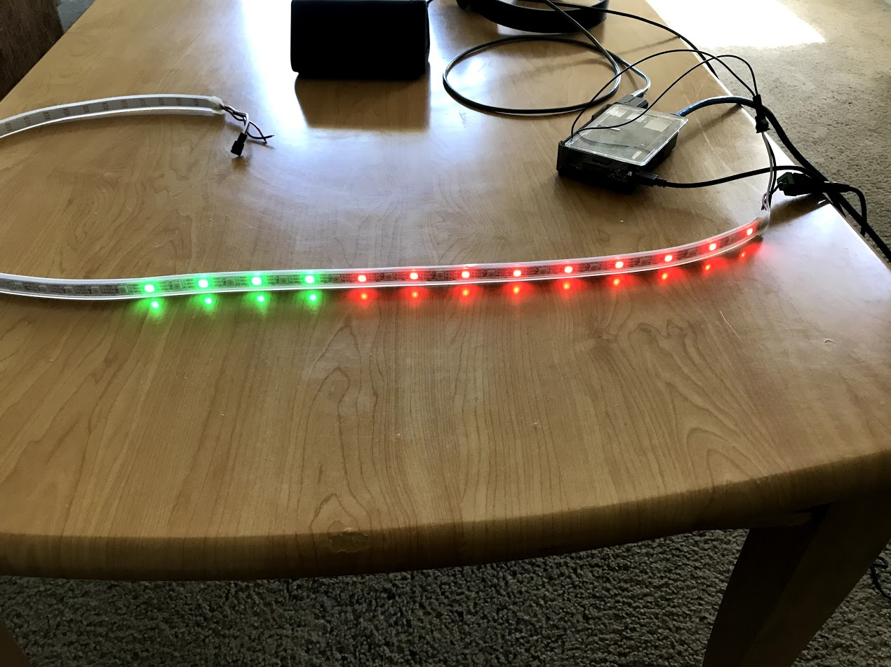

# LED strip weather

This is a python script used to display the current weather outdoors on a WS2811/WS2812 LED strip using a Raspberry Pi 3 Model B. The strip I am using was purchased from Adafruit here: https://www.adafruit.com/product/1138.

To connect the LED strip to my Raspberry Pi I followed this guide here: https://learn.adafruit.com/neopixels-on-raspberry-pi. This guide also guides you through installing all python related dependencies so you can control the LED strip.

To get the current weather, I am using the Dark Sky API. I followed the guide located here: https://darksky.net/dev/docs#forecast-request. From this guide, I created the API request to get the current weather for my location. The API request contains your API key that you get when you register for Dark Sky, the X coordinate and Y coordinate set to your current physical location, and an optional temperature units tag which defaults based on your geographical location. 

These values must all be set in the script to your own personal values. Since Dark Sky allows you 1,000 API requests per day for free, this service is completely free to use in most cases. The weather values have also been the most accurate compared to other weather APIs I have tried.

Other values that can be set in the script are the RGB values of the LEDs, which GPIO pin on the Raspberry Pi is used, how many LEDs are active (40 by default), and the brightness of the LEDs.

To manage the automation of the script, I set the script to run every 5 minutes using ```cron```. To do this on the Raspberry Pi, run ```sudo crontab -e```, and place a line at the bottom of the file that looks like this:

```*/5 * * * * /usr/bin/python3 /home/pi/weather.py```

The second part would need to be changed to the location of this python script.

Finally, here is an example picture of the LED strip displaying a temperature of 49 degrees Fahrenheit:



As you can see, the green LEDs contain the tens place, and the red LEDs contain the ones place.
